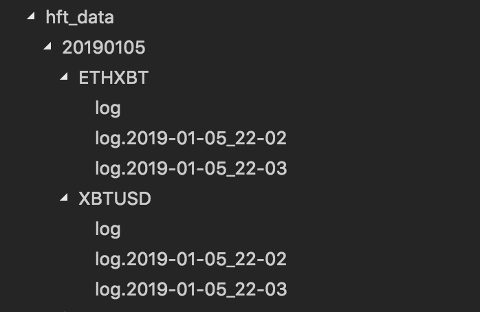
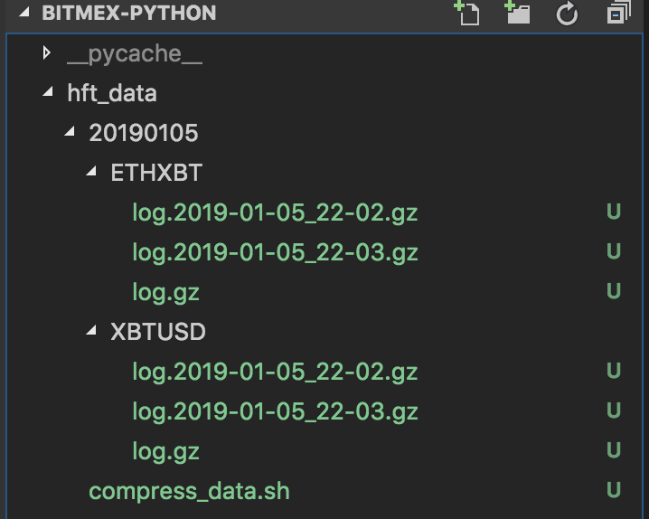

# Python Recorder for BitMEX Ticker Data

In short, I record the ticker data (orderbook, trades) directly using **logging module** of python. Then, **compress** the log files and delete the originals **periodically**. In detail, for each ticker/pair, 24 files which include the ticker data of 24 hours are recorded in the folder named with ticker name. Then, the corn jobs will start to collect data and compress the data every day.

## 1. Explination:

### 1.1 Why Adopt .gz files

**CSV file** is easy to read and analyze the date in it. However, the file size is too large to record market data for over 300 tickers/trading pairs.

**HDF5 data format** for pretty fast serialization to large datasets with small file size. HDF5 data is adopted by multiple high-frequency trading companies.

After consulting with employees in **Huobi.com**, I choose the same storage method with them in Huobi.com for storing ticker data as **.gz files** with well-organized file path. Also, according to the [discussion](https://www.zhihu.com/question/268114325) in the forum, saving ticker data within .gz files is widely adopted all over the world.

```
1. easy to code
2. the .gz file size is small
3. the file architecture is clear
4. widely adopted all over the world.
```

### Notice:

Currently, I recorded the data **every minute** instead of every hour for illustration. It can be easily changed from "Minute" to "Hour" by `logging.handlers.TimedRotatingFileHandler`.

Currently, I subscribe orderBook10 and **orderBook10** pushes the top 10 levels on every tick, but transmits much more data. I do not choose to subscribe **orderBookL2_25** as bitMEX does not provides `checkbit` periodically like bitfinex websocket API. The checkbit is used to check the correctess of orderbook. Without it, mistake happens as long as one update is lost.

## 2. Collect Data

```sh
pip install websocket-client==0.53.0

chmod a+x stop_get_data.sh
chmod a+x start_get_data.sh
./stop_get_data.sh    # kill all active python processes
./start_get_data.sh    # start to record data
```

### 2.1 Original Data Example

In order to **reduce the size of each file**, I only record the directory values of websocket responses instead of the overall directory. Also, the file size **has be further reduced** after each list is formatted as **a string** in the before logging.

In `/20190105/ETHXBT/log.2019-01-06_22-02` (before compressing):

```
trade_partial ['2019-01-06T10:41:09.054Z, ETHXBT, Buy, 1, 0.04006, MinusTick, 6a4b2d87-eec1-a925-16c3-92ce233020ef, 4006000, 1, 0.04006']
orderBook10_partial ['ETHXBT, [[0.03999, 375], [0.03966, 625], [0.03962, 187], [0.03951, 1], [0.03948, 1249], [0.03942, 83], [0.03938, 100], [0.03936, 100], [0.039, 1], [0.0384, 5]], [[0.04005, 125], [0.04006, 250], [0.04038, 625], [0.04049, 1], [0.04056, 1249], [0.041, 1], [0.04156, 8], [0.04165, 5], [0.042, 10], [0.04211, 100]], 2019-01-06T10:45:50.064Z']
orderBook10_updating ['ETHXBT, [[0.04005, 121], [0.04006, 250], [0.04038, 625], [0.04049, 1], [0.04056, 1249], [0.041, 1], [0.04156, 8], [0.04165, 5], [0.042, 10], [0.04211, 100]], 2019-01-06T10:45:58.095Z, [[0.03999, 375], [0.03966, 625], [0.03962, 187], [0.03951, 1], [0.03948, 1249], [0.03942, 83], [0.03938, 100], [0.03936, 100], [0.039, 1], [0.0384, 5]]']
trade_inserting ['2019-01-06T10:45:58.095Z, ETHXBT, Buy, 4, 0.04005, MinusTick, 9f699c23-48a7-f1a0-8213-efa692d2d042, 16020000, 4, 0.1602']
orderBook10_updating ['ETHXBT, [[0.03962, 187], [0.03951, 1], [0.03942, 83], [0.03938, 100], [0.03936, 100], [0.039, 1], [0.0384, 5], [0.0375, 105], [0.0374, 100], [0.0373, 100]], [[0.04049, 1], [0.041, 1], [0.04156, 8], [0.04165, 5], [0.042, 10], [0.04211, 100], [0.05657, 1], [0.07202, 1], [0.49498, 53], [2.5, 1]], 2019-01-06T10:46:50.053Z']
```

## 3. Compress Data

```sh
cd hft_data
chmod a+x compress_data.sh
./compress_data.sh
# compress every file in a directory separately and delete originals
```

### 3.1 before compressing



### 3.2 after compressing



## 4. TODO:

1. write a cronjob to run `./stop_get_data.sh` and `./start_get_data.sh` everyday
2. write a coonjob to run `./compress_data.sh` everyday

## 5. Reference:

1. https://github.com/BitMEX/api-connectors/tree/master/official-ws/python
2. https://quant.stackexchange.com/questions/29572/building-financial-data-time-series-database-from-scratch
3. https://www.zhihu.com/question/268114325
4. https://stackoverflow.com/questions/10363696/how-to-gzip-each-file-separately-inside-a-folder-and-then-if-successful-delete-t
